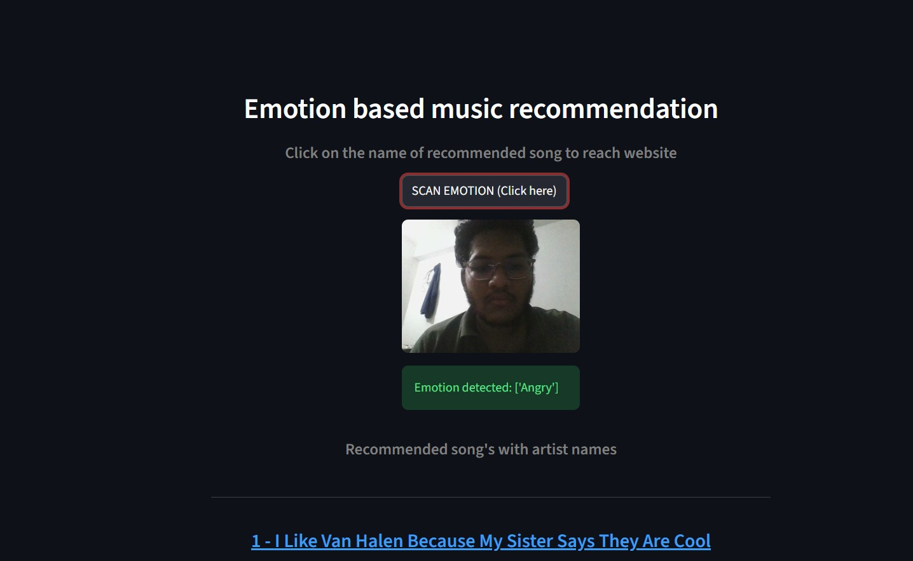
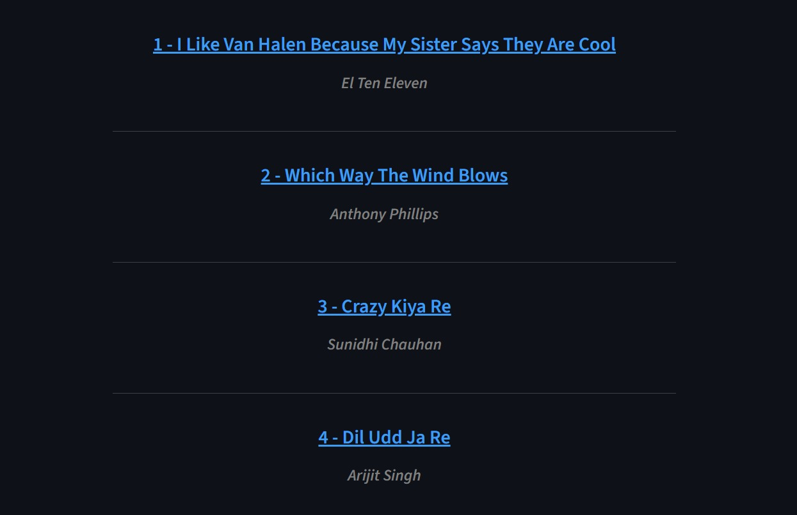

# 🎵 Facial Emotion Based Music Recommendation System

##  System Architecture

Webcam
   ↓
Face Detection (OpenCV + Haar Cascade)
   ↓
Emotion Classification (CNN Model)
   ↓
Emotion Aggregation (Most Frequent Emotion)
   ↓
Music Recommendation (Dataset Filtering)
   ↓
Recommend Music

#  Facial Emotion Based Music Recommendation System

##  Project Description
This project is a machine learning-based application that detects a user’s facial emotion using a webcam and recommends music that matches the detected emotion.  
It integrates computer vision, deep learning, and data processing into a single interactive web application.

The goal of this project is to provide an intelligent and automated music recommendation experience based on human emotions.

---

##  Features
- Real-time facial emotion detection
- Webcam-based face capture
- Emotion classification using a CNN model
- Emotion-based music recommendation
- Clickable song links with artist names
- Interactive web interface using Streamlit

---

##  Technologies Used

### Programming Language
- Python

### Libraries & Frameworks
- Streamlit – Web application framework
- OpenCV – Face detection and webcam access
- CNN - To predict Emotion
- TensorFlow / Keras – Emotion classification model
- NumPy – Numerical operations
- Pandas – Music dataset processing

---

##  How the System Works

1. User clicks **SCAN EMOTION**
2. Webcam captures facial frames
3. Face is detected using Haar Cascade (OpenCV)
4. Detected face is resized and preprocessed
5. CNN model predicts emotion for each frame
6. Most frequent emotion is selected
7. Music dataset is filtered based on emotion
8. Recommended songs are displayed with links

---

## 📸 Screenshots

###  Facial Emotion Detection


###  Recommended Songs Based on Emotion


##  Machine Learning Model

- Model Type: Convolutional Neural Network (CNN)
- Input: 48 × 48 grayscale facial image
- Output: 7 emotion classes  
  - Angry  
  - Disgusted  
  - Fearful  
  - Happy  
  - Neutral  
  - Sad  
  - Surprised  

### Training Information
The model was trained offline on a facial emotion dataset and saved as `model.h5`.  
In this project, the pre-trained model is loaded and used only for emotion prediction.

---

##  Dataset Used

- File: `muse_v3.csv`
- Contains:
  - Song name
  - Artist
  - Emotion tags
  - Valence (pleasantness)
  - External music links

Songs are categorized and sampled based on detected emotions.

---

##  How to Run the Project

### Step 1: Clone the Repository
```bash
git clone https://github.com/your-username/Facial-emotion-based-music-recommendation-system.git
cd Facial-emotion-based-music-recommendation-system
